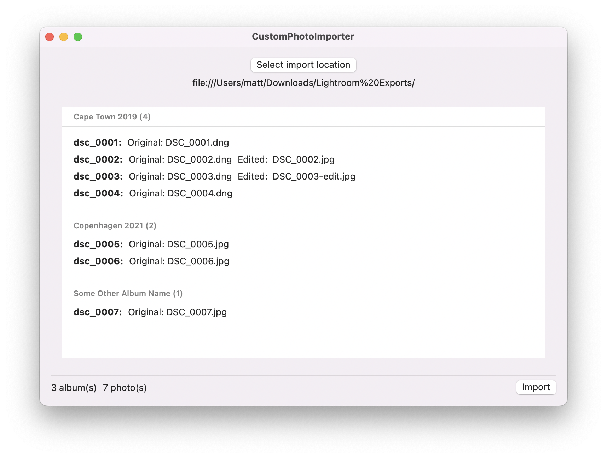
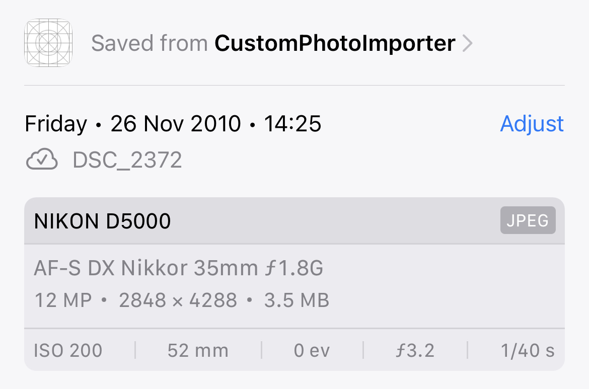

# CustomPhotoImporter

A simple app that I created to migrate my photos from Lightroom Classic to Apple's Photos.app.



This is optimised for my specific needs and the code is just barely good enough to do what I needed it to do. This was a one-time operation for me, so I have no intent to continue working on this app.

## Why

The purpose of the app is to migrate both originals AND the adjusted versions of photos from Lightroom to Photos.

## How

The app expects a file structure that looks something like this:

```
Lightroom Exports
├── Cape Town 2019
│   ├── DSC_0001.dng
│   ├── DSC_0002.dng
│   ├── DSC_0002.jpg
│   ├── DSC_0003-edit.jpg
│   ├── DSC_0003.dng
│   └── DSC_0004.dng
├── Copenhagen 2021
│   ├── DSC_0005.jpg
│   ├── DSC_0006-edit.jpg
│   └── DSC_0006.jpg
└── Some Other Album Name
    └── DSC_0007.jpg
```

* `Lightroom Exports`: the root of the photo exports from Lightroom
  * `Cape Town 2019`, `Copenhagen 2021`, and `Some Other Album Name`: the names of folders in Lightroom and will be created as albums in Photos.
    * `DSC_0001.dng`: an original, RAW photo exported as a DNG from Lightroom (without any adjustments or edits)
    * `DSC_0002.dng` + `DSC_0002.jpg`: an original RAW photo **plus** a JPEG export of all the adjustments and edits. These will be imported as a single photo into Photos (i.e. the original + the JPEG as the adjusted version)
    * `DSC_0003.dng` + `DSC_0003-edit.jpg`: also an original **plus** a JPEG export
    * `DSC_0005.jpg` + `DSC_0005-edit.jpg`: an original JPEG **plus** a JPEG export with edits and adjustments baked in

I used the [jR Folder Publisher](http://regex.info/blog/lightroom-goodies/folder-publisher) Lightroom to export my photos from Lightroom to a suitable folder structure.

## Caveats

* Try the import with a small subset of photos first
* I recommend ensuring that all your photos have sane dates in their EXIF/metadata or else they'll appear incorrectly in the time-based views in Photos. In my case I had a few albums with scanned photos which I ended up re-importing after I updated their EXIF data to be at least approcimately correct.
* There's no deduping of photos at all. Running the import multiple times will results in duplicate images in Photos
* Each photo will show “Saved from CustomPhotoImporter” in the detail view 
* The imports aren't asynchronous so the app will appear to freeze while the import is happening
